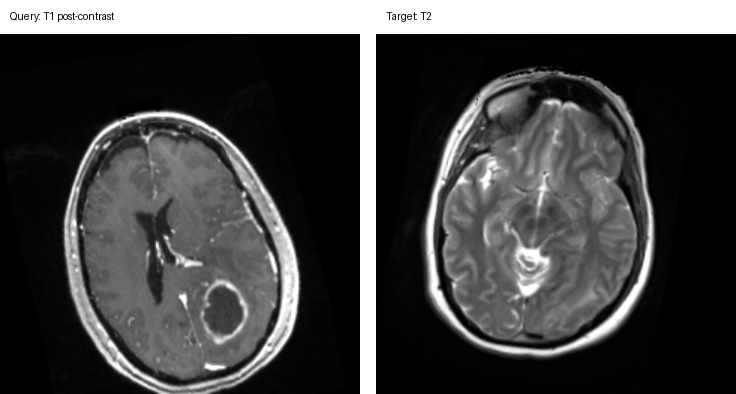
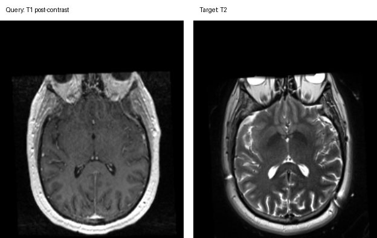

# Cross-Modal Content-Based Retrieval for 3D Medical Images

> Retrieve the same patient across MRI modalities — given a contrast-enhanced T1 (ceT1) brain
> scan, rank a gallery of T2 scans so the **same patient's** T2 comes out on top.

Built for the **EHL Paris 2026 Hackathon** — *Cross-modal Content-based Retrieval for 3D Medical
Images* track (Inria / Paris Brain Institute / PRAIRIE). Content-based retrieval lets clinicians
find related cases directly from image appearance rather than metadata.

**Best result: `0.703` macro-MRR** on the Kaggle leaderboard (baseline: `0.455`), using a
**training-free MIND-descriptor** method — no learned model in the winning path.

---

## The challenge

For each query brain MRI, rank every candidate target volume so the true same-subject target
ranks as high as possible. Queries are **T1 post-contrast**; targets are **T2**. The catch is
that you only get labelled training pairs from one clean dataset, but are scored on three
datasets of escalating difficulty:

| Dataset | What makes it hard | Best MRR |
|---------|--------------------|:--------:|
| **d1** — aligned | Modality gap only (ceT1 vs T2); volumes share a common voxel grid | 0.72 |
| **d2** — deformed | d1 + independent random rigid + elastic deformation on each side (grids no longer align) | ~0.5–0.7 |
| **d3** — pre→intra-op | Different scanner, structurally different anatomy (surgical cavities), varied array shapes | 0.85 |

**Metric:** macro Mean Reciprocal Rank — `score = (d1_MRR + d2_MRR + d3_MRR) / 3`.

<p align="center">
  
  
</p>
<p align="center"><em>Example correct query–target pairs from dataset2 (left) and dataset3 (right).</em></p>

See [`docs/desc.md`](docs/desc.md) and [`baseline/official/data_README.md`](baseline/official/data_README.md)
for the full task spec.

---

## How the winning solution works — MIND descriptors

The core idea: **compare local structure, not intensity.** [MIND](https://doi.org/10.1016/j.media.2012.05.008)
(Modality Independent Neighbourhood Descriptor) turns every voxel into a 6-channel vector
describing how similar its local patch is to its 6 axis-aligned neighbours. Because it encodes
the *pattern* of tissue boundaries rather than absolute brightness, a white-matter/CSF edge looks
the same in T1 and T2 — the modality gap disappears, and it needs **no training**:

```
MIND(ceT1 of patient X) ≈ MIND(T2 of patient X)   ← modality gap gone
MIND(ceT1 of patient X) ≠ MIND(T2 of patient Y)   ← identity preserved
```

The solution routes each dataset to the matcher that fits it:

- **d1 (aligned)** → **dense MIND**: compare the full 6-channel MIND fields voxel-by-voxel via
  cosine similarity. On a shared grid this is a near-perfect signal.
- **d2 (deformed)** → **affine registration + dense MIND**: each volume is affine-registered
  (rigid + scale) to a canonical MIND template built from clean d1 volumes, using MIND cosine
  similarity as the (modality-invariant) cost. This single fix lifted the d2 proxy from **0.15 → 0.72**
  and the macro score from **0.61 → 0.70**.
- **d3 (intra-op)** → **shape prior + global MIND**: the raw NIfTI array shape is a strong
  patient fingerprint for this clinical set; a global MIND embedding breaks ties.

Full write-up with algorithms and code walkthrough: **[`docs/solution-analysis.md`](docs/solution-analysis.md)**.

### What we tried and rejected

Kept for an honest research record (in [`experiments/`](experiments/)):

- **Learned contrastive CNNs** (raw-intensity & MIND-input CLIP-style 3D CNNs) — only ~0.17 macro
  MRR. 350 training pairs is far too few for a 3D CNN to generalise to d2/d3.
- **BraTS identity lookup** — the competition patients aren't in public BraTS-2021/2023, so it
  found no matches.

---

## Repository layout

| Folder | Purpose |
|--------|---------|
| [`solution/`](solution/) | **The winning MIND method** — runnable, self-contained ([its README](solution/README.md)) |
| [`experiments/`](experiments/) | Learned-embedder attempts that didn't win (kept for the honest story) |
| [`baseline/`](baseline/) | The organizer's official baseline (forked) + our Kaggle-adapted copy |
| [`docs/`](docs/) | Challenge brief, solution analysis, progress log, and the pitch deck |
| [`tools/`](tools/) | Dev plumbing for the hybrid local↔GPU-box workflow |
| [`submissions/`](submissions/) | Generated Kaggle submission CSV(s) — incl. the 0.703 `submission_best.csv` |

Key docs: [solution analysis](docs/solution-analysis.md) · [experiments analysis](docs/experiments-analysis.md)
· [progress log](docs/progress-log.md) · [workflow](docs/workflow.md) · [offline eval results](docs/eval-results.md)

---

## Running it

The data (~28 GB of NIfTI volumes) is **not** included — download it from the
[Kaggle competition](https://www.kaggle.com/t/b33ec3e76c3d4e16a6b56852470b3ebf) (slug
`ehl-paris-medical-image-retrieval`) and point `DATA_ROOT` at it. A GPU is recommended.

**Generate the best submission** (run from inside `solution/`, so its sibling modules resolve):

```bash
cd solution
DATA_ROOT=/path/to/kaggle_dataset python make_submission_best.py
# → submission_best.csv (377 rows), ready to upload to Kaggle
```

Tunable env vars: `REG_ITERS` (d2 registration iterations, default 70) · `N_TMPL` (canonical
template volumes, default 40) · `D3_MIND_W` (d3 MIND tiebreak weight, default 0.3) · `GRID`
(normalisation cube size, default 96).

**Reference baseline** (the organizer's tiny slice-CLIP, adapted for Kaggle) lives in
[`baseline/kaggle_baseline.py`](baseline/kaggle_baseline.py).

### Setup

```bash
cp .example.env .env   # then fill in KAGGLE_API_TOKEN (and JUPYTER_* if using the GPU box)
```

`.env` is gitignored — never commit real secrets. Dependencies are standard scientific-Python plus
PyTorch, MONAI, and nibabel.

---

## Workflow & credits

Developed with a **hybrid workflow**: code authored locally, training/inference run on a remote
GPU box (and Kaggle, where the data is pre-mounted). Details in [`docs/workflow.md`](docs/workflow.md).

Hackathon deliverables were a pitch deck ([`docs/presentation_TUM_AI.pdf`](docs/presentation_TUM_AI.pdf)),
this repository, and a live demo. AI-assisted development sessions were captured with
[`entire`](https://entire.io) for reproducibility. Built on the official baseline by
[NicoStellwag/ehl-paris-2026-medical-retrieval](https://github.com/NicoStellwag/ehl-paris-2026-medical-retrieval).
